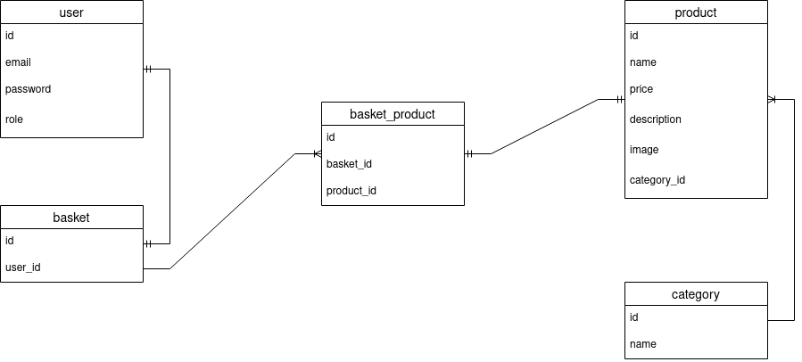

# React sushi shop

SPA application with client-server architecture.

1. Authorisation / Registration. JWT. **`Done.`**
2. REST Api with Postgresql (CRUD) **`Done.`**
3. Advanced authorisation, access tokens, refresh tokens etc... **`Done.`**
4. User's Personal account with previous orders and personal data. **`In Progress...`**
5. Administrator's panel (create / delete / update products, users, categories). **`In Progress...`**
6. Page with Product categories. **`Done.`**
7. Product sorting capability. **`Done.`**

## Deploy

https://eclipsemode.github.io/React-sushi/  **`Without server`**

## Used technologies

* React, Typescript
* Redux-toolkit
* SASS
* NodeJS, Express
* PostgresSQL

## Packages Frontend**

    "@reduxjs/toolkit": "^1.8.5",
    "@testing-library/jest-dom": "^5.16.5",
    "@testing-library/react": "^13.3.0",
    "@testing-library/user-event": "^14.4.3",
    "@types/jest": "^27.5.2",
    "@types/node": "^17.0.45",
    "@types/react": "^18.0.17",
    "@types/react-dom": "^18.0.6",
    "@types/lodash.debounce": "^4.0.7",
    "@types/qs": "^6.9.7",
    "axios": "^0.27.2",
    "lodash.debounce": "^4.0.8",
    "qs": "^6.11.0",
    "react-content-loader": "^6.2.0",
    "react-icons": "^4.4.0",
    "react-router-dom": "^6.3.0",
    "react": "^18.2.0",
    "react-dom": "^18.2.0",
    "react-redux": "^8.0.2",
    "react-scripts": "5.0.1",
    "typescript": "^4.7.4",
    "web-vitals": "^2.1.4"

## Packages Backend**

    "bcrypt": "^5.0.1",
    "cookie-parser": "^1.4.6",
    "cors": "^2.8.5",
    "dotenv": "^16.0.1",
    "express": "^4.18.1",
    "express-fileupload": "^1.4.0",
    "jsonwebtoken": "^8.5.1",
    "pg": "^8.8.0",
    "pg-hstore": "^2.3.4",
    "sequelize": "^6.21.4",
    "uuid": "^8.3.2"

## Admin data

<pre>login: admin@mail.ru
password: 12345678</pre>

## UML Project

**`In Progress...`**

## UML Database

## Available Scripts

In the project directory, you can run:

### Apply from 'client' folder to run application - `npm start`

Runs the app in the development mode.\
Open [http://localhost:3000](http://localhost:3000) to view it in the browser.

The page will reload if you make edits.\
You will also see any lint errors in the console.

### Apply from 'server' folder to run application - `npm start`

Runs the server on [http://localhost:5000](http://localhost:5000).\
Open [http://localhost:5000](http://localhost:5000) to view it in the browser.

The page will reload if you make edits.\
You will also see any lint errors in the console.